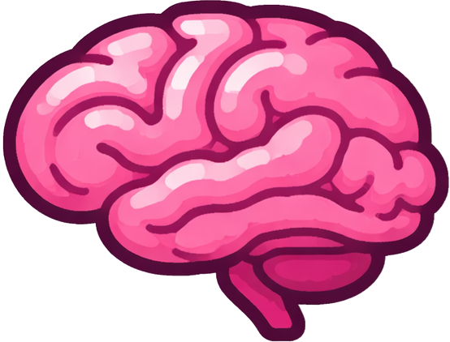

# invertmeeg - A high-level Python library for M/EEG inverse solutions

<p>
  
</p>

[](https://pypi.org/project/invertmeeg/)
[](https://www.python.org/downloads/)
[](https://www.gnu.org/licenses/gpl-3.0)

This package provides **96 inverse solvers** for M/EEG source imaging, integrating
with the [mne-python](https://mne.tools) framework. It covers minimum norm
methods, beamformers, Bayesian approaches, sparse recovery, subspace methods,
and deep learning models in a unified API.

Read the [documentation here.](https://lukethehecker.github.io/invertmeeg/)

## Installation

The recommended way to install `invertmeeg` is using [uv](https://github.com/astral-sh/uv):

```bash
uv add invertmeeg
```

Alternatively, you can use `pip`:

```bash
pip install invertmeeg
```

### Extras
- **Neural Networks**: `uv add "invertmeeg[ann]"` (or `pip install "invertmeeg[ann]"`)
- **Visualization**: `uv add "invertmeeg[viz]"` (or `pip install "invertmeeg[viz]"`)

## Development

If you are contributing to `invertmeeg`, we use `uv` and `make` to manage the development environment and code quality.

### Setup
```bash
make install
```
This will sync all dependencies (including dev tools) and install the pre-commit hooks.

### Manual uv setup, install all packages except ann
```bash
uv sync --extra viz --extra docs --group dev
```

### Useful Commands
- `make lint`: Run Ruff and Mypy checks.
- `make format`: Auto-format code with Ruff.
- `make test`: Run the test suite with pytest.
- `make check`: Run all linting and tests.
- `make clean`: Remove temporary cache files (__pycache__, .mypy_cache, etc.).

## Quick Start

```python
from invert import Solver

# fwd = ...   (mne.Forward object)
# evoked = ... (mne.Evoked object)

solver = Solver("MNE")
solver.make_inverse_operator(fwd)
stc = solver.apply_inverse_operator(evoked)
stc.plot()
```

## Features

- **96 inverse solvers** accessible through a single `Solver("solver_id")` interface
- [**Interactive benchmark leaderboard**](https://lukethehecker.github.io/invertmeeg/benchmarks/) -- compare solver performance across datasets, metrics, and categories
- Automatic regularization (GCV, L-curve, product methods)
- Returns standard `mne.SourceEstimate` objects
- Simulation utilities for benchmarking

## Solver Categories

| Category | Count | Examples |
|----------|-------|---------|
| Minimum Norm | 9 | MNE, wMNE, dSPM, FISTA, GFT-MNE |
| LORETA | 4 | LORETA, sLORETA, eLORETA, SSLOFO |
| Other Minimum-Norm-like | 3 | LAURA, Backus-Gilbert, S-MAP |
| Bayesian | 21 | Champagne variants, Gamma-MAP, MSP, CMEM, VB-SBL |
| Beamformers | 26 | LCMV, DICS, ESMV, SAM, Flex-ESMV, ReciPSIICOS |
| Dipole Fitting | 2 | ECD, SESAME |
| Structured Sparsity | 1 | Total Variation |
| Neural Networks | 4 | FC/ESInet, CovCNN, LSTM, CNN |
| Matching Pursuit | 11 | OMP, COSAMP, SOMP, BCS, Subspace Pursuit |
| MUSIC/Subspace | 11 | MUSIC, RAP-MUSIC, FLEX-MUSIC, Adaptive-AP |
| Basis Functions | 1 | GBF |
| Other | 3 | EPIFOCUS, APSE, Random-Noise |

## Full Algorithm List

### Minimum Norm

| Full Solver Name | Abbreviation |
|------------------|--------------|
| Minimum Norm Estimate | "mne" |
| Minimum Norm Estimate with Graph Fourier Transform | "gft-mne" |
| Weighted Minimum Norm Estimate | "wmne" |
| Dynamic Statistical Parametric Mapping | "dspm" |
| Minimum Current Estimate | "l1", "fista", "mce" |
| Minimum L1 Norm GPT | "gpt", "l1-gpt" |
| Minimum L1L2 Norm | "l1l2" |
| GFT Minimum L1 Norm | "gft-l1" |
| Self-Regularized eLORETA | "sr-eloreta", "self-regularized-eloreta" |

### LORETA

| Full Solver Name | Abbreviation |
|------------------|--------------|
| LORETA | "loreta", "lor" |
| sLORETA | "sloreta", "slor" |
| eLORETA | "eloreta", "elor" |
| SSLOFO | "sslofo" |

### Other Minimum-Norm-like Algorithms

| Full Solver Name | Abbreviation |
|------------------|--------------|
| LAURA | "laura", "laur" |
| Backus-Gilbert | "backus-gilbert", "b-g", "bg" |
| S-MAP | "s-map", "smap" |

### Bayesian

| Full Solver Name | Abbreviation |
|------------------|--------------|
| Champagne | "champagne", "champ" |
| EM Champagne | "em-champagne", "emc" |
| Convexity Champagne | "convexity-champagne", "coc", "mm-champagne" |
| MacKay Champagne | "mackay-champagne", "mcc" |
| TEM Champagne | "tem-champagne", "temc" |
| AR-EM Champagne | "arem-champagne", "aremc" |
| Low SNR Champagne | "low-snr-champagne", "lsc" |
| Adaptive Champagne | "adaptive-champagne", "ac" |
| Noise Learning Champagne | "nl-champagne", "nlc" |
| Omni Champagne | "omni-champagne", "oc" |
| Flex Champagne | "flex-champagne", "fc-champ" |
| Flex NL Champagne | "flex-nl-champagne", "fnlc" |
| Gamma-MAP | "gamma-map", "gmap" |
| Source-MAP | "source-map" |
| Gamma-MAP-MSP | "gamma-map-msp" |
| Source-MAP-MSP | "source-map-msp" |
| Multiple Sparse Priors | "msp" |
| cMEM | "cmem" |
| Subspace SBL | "subspace-sbl" |
| Subspace SBL+ | "subspace-sbl-plus" |
| Variational Bayes SBL | "vb-sbl" |

### Beamformers

| Full Solver Name | Abbreviation |
|------------------|--------------|
| Minimum Variance Adaptive Beamformer | "mvab" |
| Linearly Constrained Minimum Variance | "lcmv" |
| Dynamic Imaging of Coherent Sources | "dics" |
| Standardized Minimum Variance | "smv" |
| Weight-Normalized Minimum Variance | "wnmv" |
| Higher-Order Covariance Minimum Variance | "hocmv" |
| Eigenspace Scalar Minimum Variance | "esmv" |
| Eigenspace Scalar Minimum Variance 2 | "esmv2" |
| Eigenspace Scalar Minimum Variance 3 | "esmv3" |
| Multiple Constraint Minimum Variance | "mcmv" |
| Higher-Order Covariance MCMV | "hocmcmv" |
| Reciprocal PSIICOS (Plain) | "recipsiicos" |
| Reciprocal PSIICOS (Whitened) | "recipsiicos-whitened" |
| Synthetic Aperture Magnetometry | "sam" |
| Empirical Bayesian Beamformer | "ebb" |
| Adaptive Flexible ESMV | "adapt-flex-esmv" |
| Flexible ESMV | "flex-esmv" |
| Flexible ESMV 2 | "flex-esmv2" |
| Deblurring Flexible ESMV | "deblur-flex-esmv" |
| Safe Flexible ESMV | "safe-flex-esmv" |
| Sharp Flexible ESMV | "sharp-flex-esmv" |
| Sharp Flexible ESMV 2 | "sharp-flex-esmv2" |
| Signal Subspace Projection ESMV | "ssp-esmv" |
| Iteratively Reweighted ESMV | "ir-esmv" |
| SSP Iteratively Reweighted ESMV | "ssp-ir-esmv" |
| Unit Noise Gain | "unit-noise-gain", "ung" |

### Dipole Fitting

| Full Solver Name | Abbreviation |
|------------------|--------------|
| Equivalent Current Dipole | "ecd" |
| SESAME | "sesame" |

### Structured Sparsity

| Full Solver Name | Abbreviation |
|------------------|--------------|
| Total Variation | "tv", "total-variation", "graph-tv" |

### Artificial Neural Networks

| Full Solver Name | Abbreviation |
|------------------|--------------|
| Fully-Connected Network | "fc", "esinet" |
| Covariance CNN | "covcnn", "covnet" |
| Long Short-Term Memory | "lstm" |
| Convolutional Neural Network | "cnn" |

### Matching Pursuit / Compressive Sensing

| Full Solver Name | Abbreviation |
|------------------|--------------|
| Orthogonal Matching Pursuit | "omp" |
| Compressive Sampling Matching Pursuit | "cosamp" |
| Simultaneous Orthogonal Matching Pursuit | "somp" |
| Random Embedding Matching Pursuit | "rembo" |
| Subspace Pursuit | "sp" |
| Structured Subspace Pursuit | "ssp" |
| Subspace Matching Pursuit | "smp" |
| Structured Subspace Matching Pursuit | "ssmp" |
| Subspace-based Subspace Matching Pursuit | "subsmp" |
| Iterative Subspace-based Subspace Matching Pursuit | "isubsmp" |
| Bayesian Compressive Sensing | "bcs" |

### MUSIC/RAP/Subspace

| Full Solver Name | Abbreviation |
|------------------|--------------|
| Multiple Signal Classification | "music" |
| Recursively Applied and Projected MUSIC | "rap-music", "rap" |
| Truncated Recursively Applied and Projected MUSIC | "trap-music", "trap" |
| Flexible RAP-MUSIC | "flex-music", "flex" |
| Flexible RAP-MUSIC 2 | "flex-music-2" |
| Flexible Signal Subspace Matching | "flex-ssm" |
| Signal Subspace Matching | "ssm" |
| Flexible Alternating Projections | "flex-ap" |
| Alternating Projections | "ap" |
| Adaptive Alternating Projections | "adaptive-ap", "aap" |
| Generalized Iterative | "generalized-iterative", "gi" |

### Basis Functions

| Full Solver Name | Abbreviation |
|------------------|--------------|
| Geometrically Informed Basis Functions | "gbf" |

### Other

| Full Solver Name | Abbreviation |
|------------------|--------------|
| EPIFOCUS | "epifocus" |
| APSE | "apse" |
| Random Noise (Baseline) | "random-noise", "random" |

## Licensing

This project is **dual-licensed**:

- **Open source:** GPLv3.
- **Commercial alternative:** if you want to use `invertmeeg` in a proprietary/closed-source product without GPLv3 obligations, a separate commercial license is available (contact below).

### For Researchers & Open Source Users (GPLv3)
We love science. This library is free to use for research, education, thesis
projects, and open source projects under the terms of GPLv3.

* **Attribution required:** please credit `invertmeeg` (and ideally cite this
  repository) in any publications, reports, or released artifacts that use it.
* **Distribution note:** if you distribute software that includes/links this
  library, you need to comply with GPLv3 (including providing corresponding
  source under GPLv3).

### For Industry & Commercial Entities
If you are a company, a startup, or an individual intending to use this library
in a proprietary/closed-source product, please contact me to obtain a separate
commercial license.

**Contact:** `lukas.hecker.job@gmail.com`

## Citation

If you use this package and publish results, please cite as:

```
@Misc{invertmeeg2022,
  author =   {{Lukas Hecker}},
  title =    {{invertmeeg}: A high-level Python library for M/EEG inverse solutions.},
  howpublished = {\url{https://github.com/LukeTheHecker/invertmeeg}},
  year = {since 2022}
}
```

Send feedback or feature requests to [lukas.hecker.job@gmail.com](mailto:lukas.hecker.job@gmail.com).
